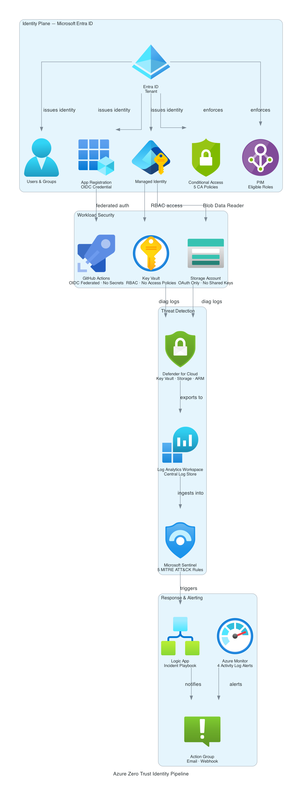

# Azure Zero Trust Identity Pipeline

A production-grade identity security pipeline built on Azure that enforces Zero Trust principles across authentication, privileged access, workload identity, and threat detection. Deployed across 7 phases using Terraform and Azure CLI.

## Architecture



The pipeline is structured in four layers, each enforcing a distinct Zero Trust control:

| Layer | Components |
|---|---|
| **Identity Plane** | Entra ID · Users & Groups · App Registration · Managed Identity · Conditional Access · PIM |
| **Workload Security** | Key Vault (RBAC, no access policies) · Storage Account (OAuth only) · GitHub Actions OIDC |
| **Threat Detection** | Defender for Cloud · Log Analytics Workspace · Microsoft Sentinel |
| **Response & Alerting** | Logic App playbook · Azure Monitor · Action Group (email + webhook) |

## What It Does

- **Zero standing permissions.** PIM enforces just-in-time privileged access with eligible role assignments requiring explicit activation. No permanent high-privilege assignments exist.
- **No stored credentials, anywhere.** Managed Identity authenticates to Key Vault and Storage. GitHub Actions uses OIDC federated identity against the app registration. No secrets in repos, pipelines, or config files.
- **RBAC at every data plane.** Key Vault uses RBAC (no access policies). Storage disallows shared keys. All assignments are scoped to the minimum required role.
- **Detection-to-response automation.** Sentinel ingests logs from Defender for Cloud via Log Analytics. Five MITRE ATT&CK-mapped analytics rules trigger a Logic App playbook that fires a webhook notification — no manual triage required.

## Modules

| Module | Resources | Phase |
|---|---|---|
| `entra_identity` | Users, groups, app registration, managed identity, storage account, RBAC | 1 |
| `conditional_access` | Named locations, 5 CA policies (report-only, requires Entra P1) | 2 |
| `key_vault` | Key Vault, OIDC federated credential, Log Analytics workspace, diagnostic settings | 3 |
| `defender` | Defender plans (Key Vault, Storage, ARM), security contact, LAW export | 4 |
| `sentinel` | Sentinel onboarding, 5 scheduled analytics rules | 5 |
| `playbooks` | Logic App workflow, HTTP trigger, webhook action | 6 |
| `monitoring` | Action group, metric alert, 4 activity log alerts | 7 |

## Analytics Rules (MITRE ATT&CK)

| Rule | Tactic | Technique |
|---|---|---|
| Multiple failed sign-ins | Credential Access | T1110 |
| Sign-in from new country | Initial Access | T1078 |
| PIM activation outside business hours | Privilege Escalation | T1078 |
| Key Vault access from unfamiliar IP | Credential Access | T1552 |
| Bulk user deletion | Impact | T1531 |

## Design Decisions

**RBAC over legacy access policies.** Every resource uses Azure RBAC. Key Vault has no access policies. Storage has no shared keys. This enforces least privilege at the data plane, not just the control plane.

**Managed identity over service principal secrets.** The workload uses a user-assigned managed identity with a scoped Storage Blob Data Reader role. No credentials exist anywhere in the pipeline.

**Federated identity for CI.** The app registration carries an OIDC federated credential for GitHub Actions. Authentication happens via token exchange — no secret rotation problem.

**CLI for what Terraform cannot own.** PIM eligible role assignments and Sentinel data connectors sit outside Terraform state and are managed via `scripts/bootstrap.sh`. Resources that require P2 licensing or Defender portal enrollment on personal tenants are documented rather than forced.

**Separate teardown lifecycle.** `scripts/teardown.sh` handles resource ordering that Terraform destroy gets wrong: Sentinel connectors before the workspace, Key Vault purge before reprovisioning, PIM cleanup before role assignments.

## Tenant Limitations (Personal Account)

This project was built on a personal Azure subscription. The following features are documented in code but require Entra ID P1/P2 to enforce:

- **Conditional Access enforcement** — 5 policies defined (MFA, legacy auth blocking, device compliance, risk-based sign-in). Set to `enabledForReportingButNotEnforced` on a free tenant. Activation requires P1.
- **PIM eligible role assignments** — Template and bootstrap script written for production use. Eligible role activation requires P2.
- **Sentinel automation rule** — Logic App playbook uses an HTTP trigger. Connecting it to Sentinel incident creation requires the Microsoft Sentinel Logic Apps connector via Defender portal.

All code is production-ready. These are licensing constraints, not architectural gaps.

## Prerequisites

- Azure subscription with Owner role
- Entra ID Global Administrator or Privileged Role Administrator
- App registration with Microsoft Graph application permissions admin-consented
- AWS S3 bucket for Terraform state (`tf-backend-jord-projs`)
- GitHub repository for OIDC federated credential

### Required Graph Permissions

```
Application.ReadWrite.All
Directory.ReadWrite.All
Group.ReadWrite.All
Policy.ReadWrite.ConditionalAccess
RoleManagement.ReadWrite.Directory
User.ReadWrite.All
```

### Provider Registrations

```bash
az provider register --namespace Microsoft.SecurityInsights
az provider register --namespace Microsoft.OperationalInsights
az provider register --namespace Microsoft.Security
az provider register --namespace Microsoft.Logic
```

## Deploy

```bash
cp terraform.tfvars.example terraform.tfvars
terraform init -backend-config=backend.hcl
terraform plan
terraform apply -auto-approve
source .env
RESOURCE_GROUP=zero-trust-identity-rg WORKSPACE_NAME=zt-identity-law ./scripts/bootstrap.sh
```

## Teardown

```bash
RESOURCE_GROUP=zero-trust-identity-rg WORKSPACE_NAME=zt-identity-law ./scripts/teardown.sh
```

## Stack

Terraform · Azure CLI · Microsoft Entra ID · Conditional Access · PIM · Azure Key Vault · Azure Storage · Defender for Cloud · Log Analytics · Microsoft Sentinel · Azure Monitor · Azure Logic Apps · GitHub Actions OIDC

## Related Projects

- [Cloud Security Lab](https://github.com/jordann6/cloud-security-lab) — Full AWS and Kubernetes threat detection, Pacu attack chain, Falco runtime security, OpenSearch SIEM, MITRE ATT&CK kill chain
- [Azure DevSecOps Pipeline](https://github.com/jordann6/azure-devsecops-project) — 4-stage GitHub Actions pipeline with SAST, Trivy, OWASP ZAP, and hardened AKS blue-green deployment
